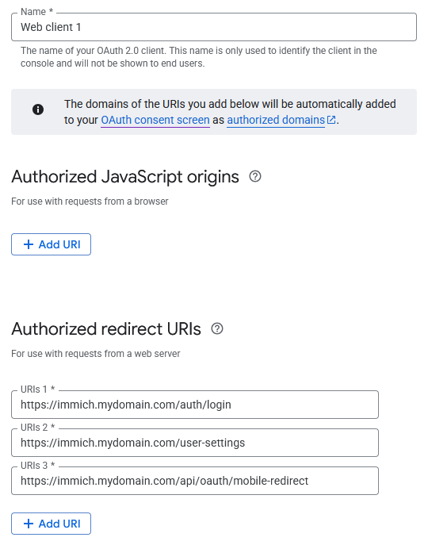
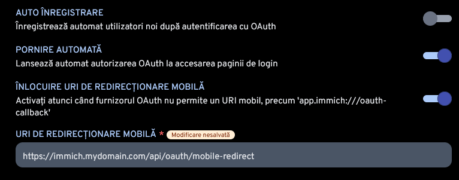

# Image backup
I chose Immich for my image backup solution as it offers a familiar interface similar to the Google Photos one. ~~At the moment, it is one of the two services that I have exposed to the internet.~~ As an additional layer of security, I chose to use [Google OAuth 2.0](https://console.cloud.google.com/auth/overview). The steps to set it up are as follows:

1. Create an OAuth app inside Google;
2. Create a new client with the following redirect URIs; 
3. Save the Client ID and Client Secret for step 5.;
4. Immich > Administration > Settings > Authentication Settings > Enable OAuth;
5. For the ISSUER_URL put `https://accounts.google.com`, and for the other fields the variables copied at step 4.;
6. Disable registering and enable mobile URI redirect, for the mobile app to work; 