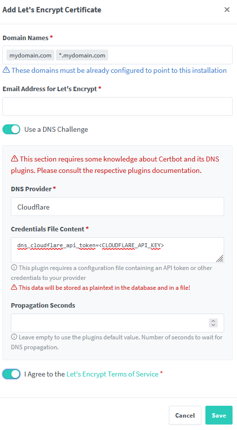
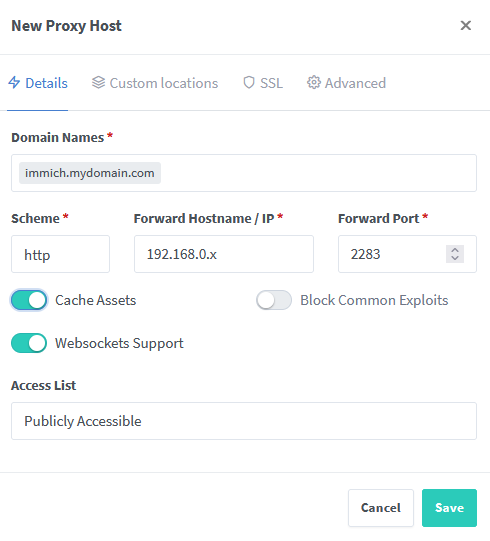

# Networking stack
These services are pivotal in connecting all the other services. I have configured both Tailscale for remote access to Jellyfin and Jellyseerr, and also VPN for routing traffic to the home network, with the former being used for friends and relatives, and the latter for personal use.

## Cloudflare
Cloudflare handles the domain and its corresponding DNS records. To use Cloudflare, you need a domain (any registrar works) that you port to Cloudflare if it is not purchashed through them. From this point on, `mydomain.com` shall refer to the domain you own. To use the domain, you need to point it to your server.

 Create the following DNS records in Cloudflare, by going to Account Home > Domains > `mydomain.com` > DNS > Records. Add the following records

| Type | Name | Content | Proxy Status | Observation | 
| - | - | - | - | - |
| A | `mydomain.com` | 192.168.0.x | DNS only - reserved IP | content is the local address of the server |
| A | `*.tail` | 100.x.x.x | DNS only - reserved IP | optional record, if using Tailscale |
| CNAME | `immich` | `mydomain.com` | DNS only | required to be separate because Immich requires an explicit origin name and not wildcard | 
| CNAME | `*` | `mydomain.com` | DNS only | wildcard for any future service | 

## NPM (Nginx Proxy Manager)
This service is used as a reverse proxy for the whole homelab, routing traffic through encrypted connections, with auto-renewal of certificates.

Steps to set up after installing npm:
1. Do the mandatory setup (create admin account);
2. Generate an API key for Cloudflare (required for DNS challenge to prove ownership of domain);
3. SSL Certificates > Add SSL certificate; 
4. *Optional: if using Tailscale, create a similar certificate but for `*.tail.mydomain.com`;
5. Hosts > Proxy Hosts > Add Proxy Host ([options might differ a little](#observations)); 
6. SSL > choose certificate created at step 3. that corresponds to the domain;

#### Observations
> If service already provides its own SSL cert and HTTPS route, choose HTTPS for Scheme, otherwise HTTP is fine since NPM proxies the traffic through a secure connection.

## Pi-Hole
Pi-Hole is used as a DNS sinkhole and local DNS resolver, to block ads network wide. At the moment no additional configuration is done, besides pointing the Primary DNS in the router's config to the Pi-Hole server.