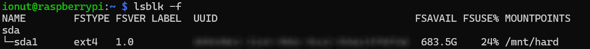

# Other
This section contains containers and services that don't belong to a category at the moment.

### Samba
Steps to install:
1. `lsblk -f` to find the partition name and UUID; 
2. `sudo umount <partition>` - in this example it would be `/dev/sda1`;
3. `sudo mount <partition> /mnt/hard`;
4. `sudo apt install samba`;
5. Edit `/etc/samba/smb.conf`;
6. `sudo chmod -R 777 /mnt/hard`;
7. `sudo systemctl restart smbd`;
8. Append the following line to `/etc/fstab` for automount on boot

> UUID=<PARTITION_UUID> /mnt/hard ext4 defaults,nofail 0 0